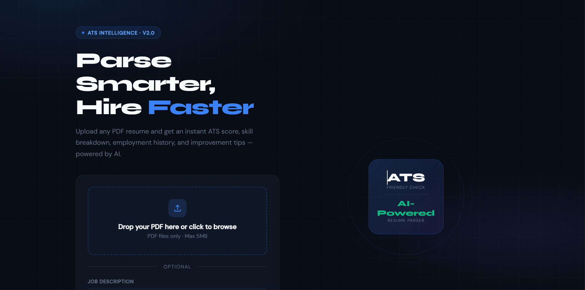
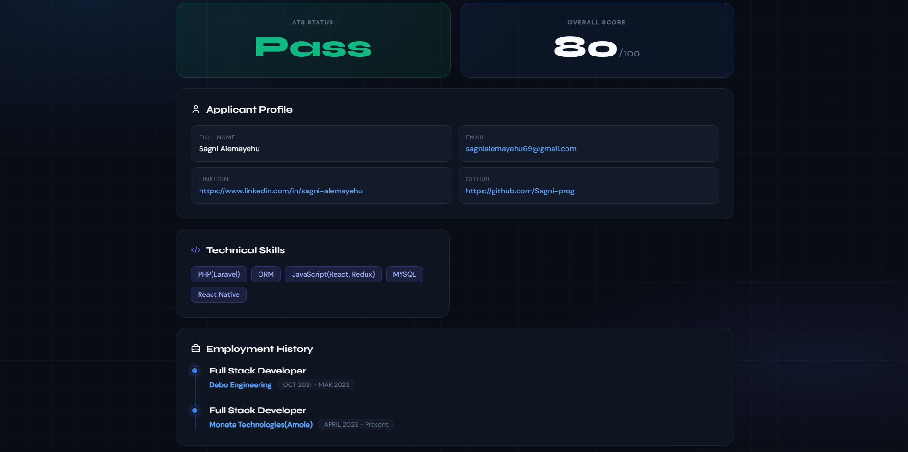

# Resume Parser App — AI Powered ATS Checker

A Flask web application that parses resumes in PDF format using AI (via OpenRouter) and checks how ATS-friendly they are. Upload your resume and instantly get structured data including skills, employment history, a resume score, and improvement suggestions.

---

## Features

- Upload resume in PDF format
- Extracts key information automatically:
  - Full name, email, LinkedIn, GitHub
  - Employment history (title, company, duration)
  - Technical and soft skills
- Scores your resume from 0–100
- Pass/Fail result based on ATS friendliness
- Optional job description matching — paste a JD to get a targeted score and missing skills
- Powered by Meta Llama 3.1 70B via OpenRouter

---

## Screenshots





---

## Tech Stack

- Python 3.10+
- Flask
- PyMuPDF (fitz) — PDF text extraction
- OpenAI SDK — OpenRouter API calls
- PyYAML — config management

---

## Project Structure

```
resume-parser/
├── app.py              # Flask app and routes
├── resumeparser.py     # AI extraction logic
├── config.yaml         # API key config (never commit this)
├── requirements.txt    # Python dependencies
├── templates/
│   └── index.html      # Frontend UI
├── assets/             # Screenshots for README
└── README.md
```

---

## Installation

**1. Clone the repository**

```bash
git clone https://github.com/your-username/resume-parser.git
cd resume-parser
```

**2. Install dependencies**

```bash
pip install -r requirements.txt
```

**3. Add your API key**

Open `config.yaml` and replace the placeholder with your real key:

```yaml
OPENROUTER_API_KEY: "sk-or-your-key-here"
```

Get a free API key at [openrouter.ai/keys](https://openrouter.ai/keys)

> **Tip:** You can also set it as an environment variable instead of editing the file:
> ```bash
> export OPENROUTER_API_KEY="sk-or-your-key-here"
> ```

**4. Run the app**

```bash
python app.py
```

**5. Open in your browser**

```
http://localhost:8000
```

---

## Usage

1. Go to `http://localhost:8000`
2. Upload your resume as a PDF file (max 5MB)
3. Optionally paste a job description for targeted analysis
4. Click **Analyse Resume** and view your results

---

## Output Fields

| Field | Description |
|---|---|
| `full_name` | Candidate's full name |
| `email` | Email address |
| `linkedin` | LinkedIn profile URL |
| `github` | GitHub profile URL |
| `employment_details` | Jobs with title, company, and duration |
| `technical_skills` | List of technical skills found |
| `soft_skills` | List of soft skills found |
| `resume_score` | Score from 0–100 |
| `pass_fail` | Pass if score ≥ 70, else Fail |
| `suggestions` | List of specific improvements |

---

## Security Notes

- `config.yaml` is listed in `.gitignore` — never remove it from there
- Never paste your real API key anywhere in code that gets committed
- Rotate your key immediately at [openrouter.ai](https://openrouter.ai) if accidentally exposed

---

## License

MIT License — free to use and modify.
